# Exploring Youth Wellness Through Social Media: A Cross-Platform Content Analysis

## Introduction

This research project investigates youth mental health trends and harmful behavioral patterns across major online platforms. By analyzing user-generated content from Reddit, YouTube Shorts, and TikTok, we aim to uncover how young people express and engage with issues related to mental and physical well-being in digital spaces.

> Note: Analyses will be added soon.

## Table of Contents
- [Topic Modeling](#topic-modeling)
  - [Topic Similarity Matrix](#topic-similarity-matrix)
- [Topic Clusters](#topic-clusters)
    - [Hierarchical Topic Clustering](#hierarchical-topic-clustering)
    - [Embedding Centroids by Topic](#embedding-centroids-by-topic)
- [Sentiment Analysis](#sentiment-analysis)
    - [Sentiment Score Distribution by Subreddit](#sentiment-score-distribution-by-subreddit)
    - [Sentiment Score Distribution by Topic](#sentiment-score-distribution-by-topic)
---

## Topic Modeling

### Topic Similarity Matrix

#### Figure 1.1: Reddit
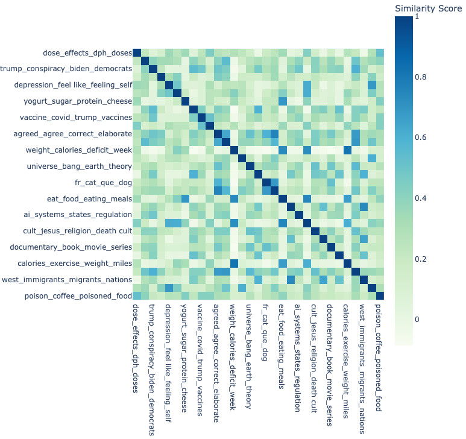

#### Figure 1.2: TikTok
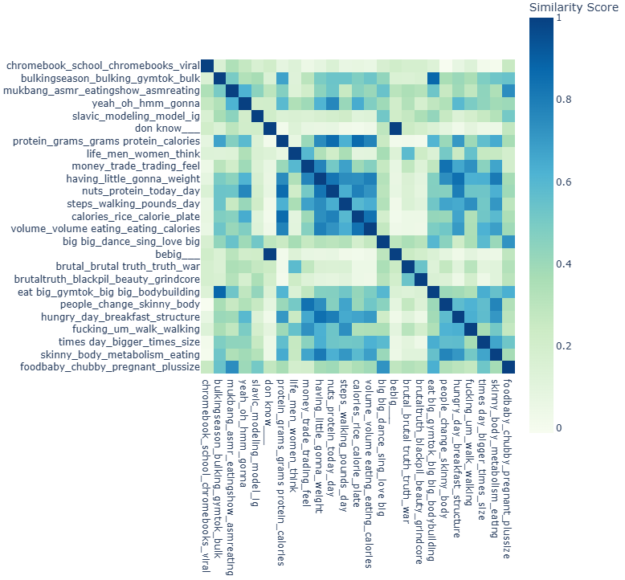

#### Figure 1.3 YouTube Shorts
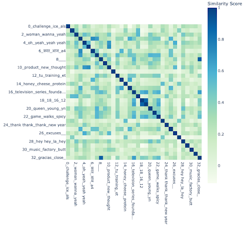

> Note: Image quality is reduced for now; a higher-resolution version will be added soon.

## Topic Clusters 

### Hierarchical Topic Clustering

#### Figure 2.1: Reddit
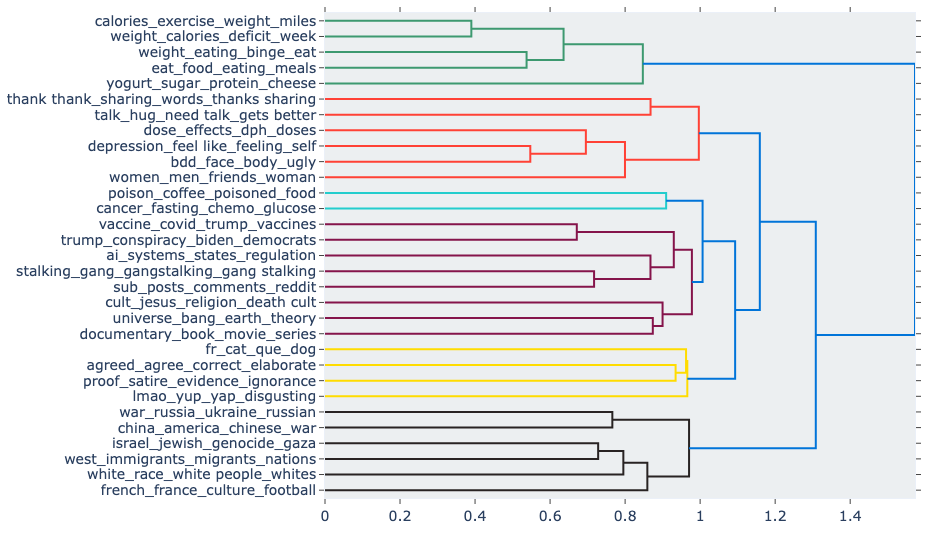

#### Figure 2.2: TikTok
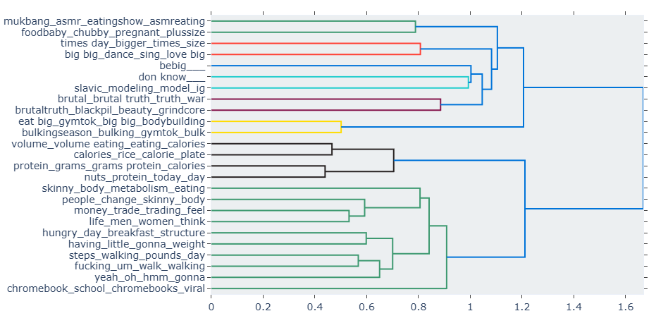

#### Figure 2.3 YouTube Shorts
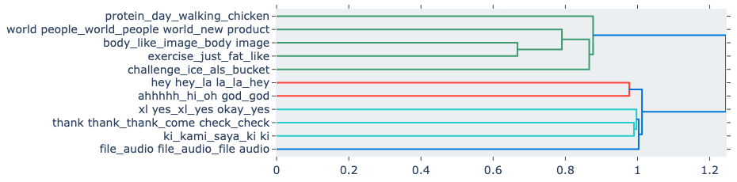

### Embedding Centroids by Topic

#### Figure 2.4: Reddit
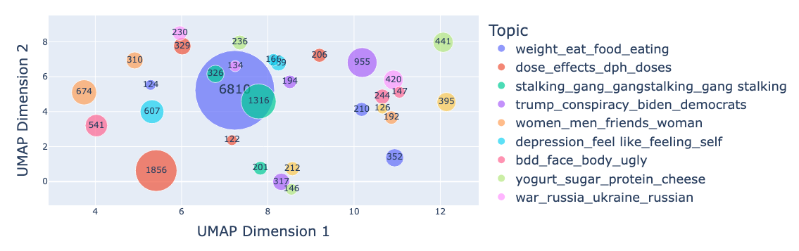

#### Figure 2.5: TikTok
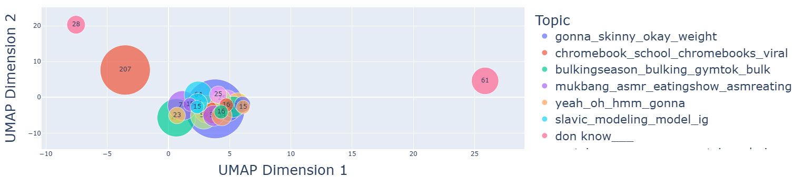

#### Figure 2.6: YouTube Shorts
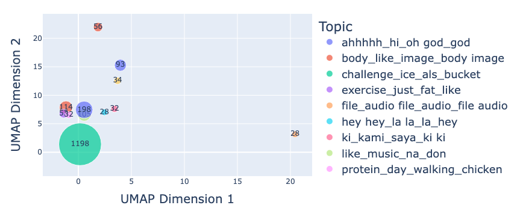

## Sentiment analysis

### Sentiment Score Distribution by Subreddit

#### Figure 3.1
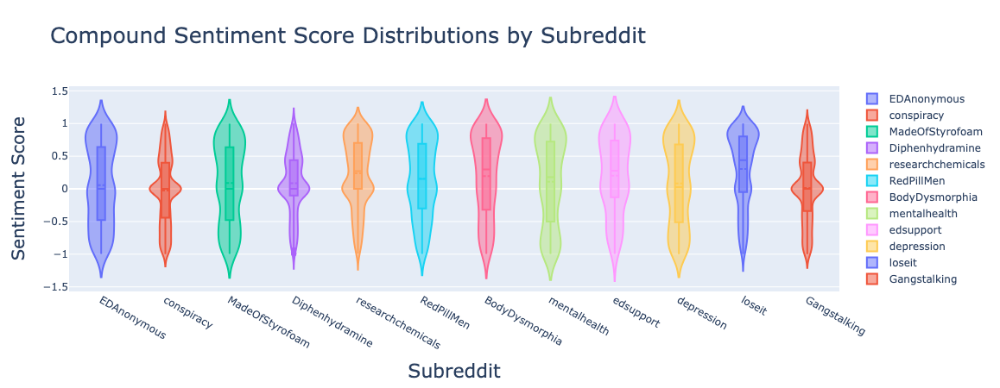

### Sentiment Score Distribution by Topic

#### Figure 3.2: Reddit
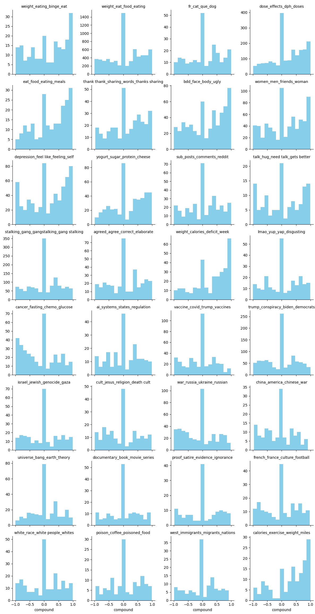

#### Figure 3.3: TikTok
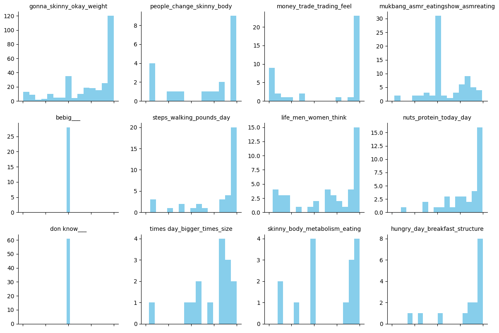
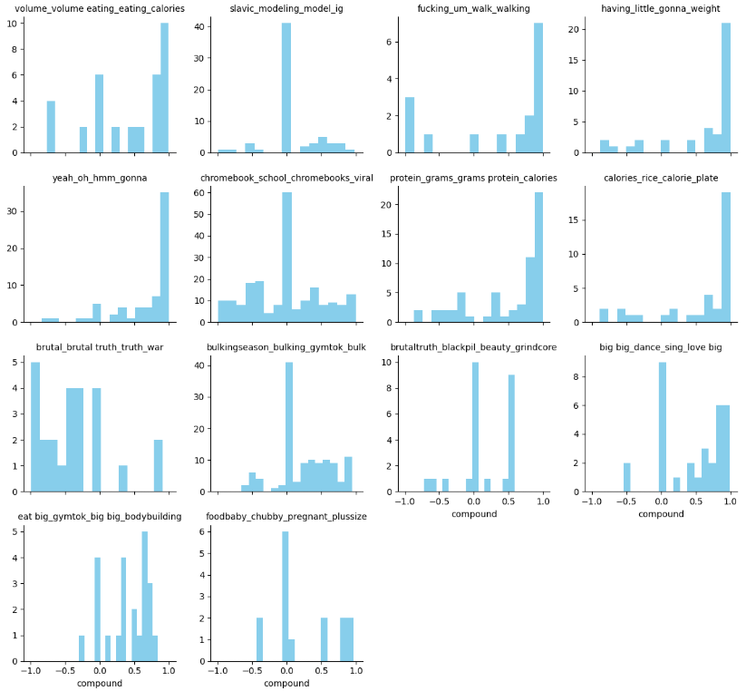

> Note: Image quality is reduced for now; a higher-resolution version will be added soon.

#### Figure 3.4: YouTube Shorts
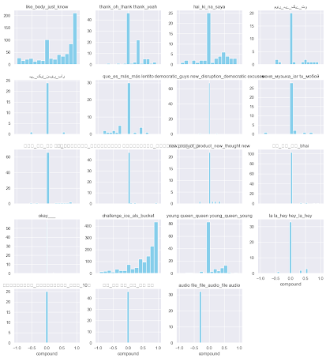

> Note: Image quality is reduced for now; a higher-resolution version will be added soon.